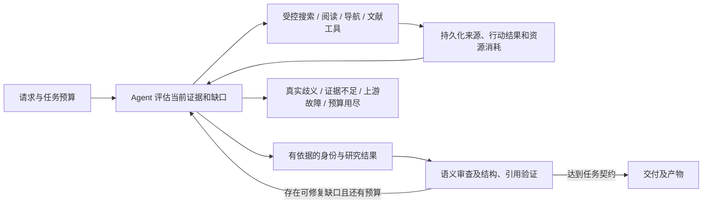

# Doctor Research 整体设计审查（2026-09-10）

状态：设计审查完成；本文保留审查时的源码与运行证据快照，后续实现见 [Agent 改造进展](doctor-research-agent-implementation-2026-09-10.zh-CN.md)。结论依据历史设计、已有运行记录，以及一次不联网的合成身份反例。审查阶段新增 SerpAPI 请求为 **0**，不包含后续开发验收。

## 结论

现有系统的服务基础总体合理，但核心研究流程不符合“让 Agent 处理研究请求”的产品目标。关键问题是：把开放网页发现、跨语言理解和人物关系核验交给了固定规则，模型主要在这些规则放行后提取、归纳和写作。对未预置的机构和医生，流程会在模型参与前失败；简单放宽规则又有误认风险。

应保留 Gateway、独立 Worker、任务隔离、预算、租约和产物管理，重构 Worker 内部的研究决策流程。让 Agent 根据已读资料决定下一步搜索、阅读、核验与补证；代码负责执行边界、资源账本、来源记录及可机械校验的契约。不能只在原流水线中增加一次翻译和一次判断，就认定已经完成 Agent 化。

用户明确的验收约束：

| 维度 | 标准及含义 |
| --- | --- |
| 总耗时 ≤ 5 分钟 | 优秀；前提是正确完成所请求的任务 |
| 5 分钟 < 总耗时 ≤ 8 分钟 | 可接受，允许合理的阅读、核实、改搜和修复 |
| 总耗时 > 8 分钟 | 需要调查原因；这是诊断阈值，不等于用户要求在第 8 分钟强制终止 |
| SerpAPI | 剩余额度有限；本轮停止新增联网测试，开发优先使用已有资料与离线证据 |
| 通用性 | 不为已知测试医生补充专用运行时名单、别名、主页模板或答案；测试真值与运行时数据隔离 |

耗时建议从服务接受请求计到结果及产物可获取，包含排队、重试和重新调度；同时拆分这些阶段用于定位。等待用户补充信息的时间单列。已有隔离探针仅测一次工作流，不包含全部服务环节，不能直接当作端到端性能验收。快速失败、空报告或降级后缩小了任务范围，都不计为“优秀完成”。

## 审查范围与证据边界

- 当前审查基于 `fix/doctor-research-generic-20260910` 分支。运行代码冻结点为 `a67d2d3`，此前审计资料提交为 `e8d97f4`；去预置版本尚未发布。
- 最近已核实的生产 Research Worker 是 `8efd541`，含已知案例相关预置。本文没有再次访问生产，也不把其他团队的 Gateway 版本变化当作 Research 发布。
- 历史设计最早提交 `ccccf1c`（2026-07-18）已将检索与核验限定为确定性代码。这是技术设计本身的取舍，不能归结为最近一个补丁偏离设计，也不能据此推断用户认可了这种取舍。
- [通用性审计](../operations/doctor-research-generalization-audit-2026-09-10.zh-CN.md)记录：去掉新加预置后，原六例身份通过 2/6；冻结代码后的八例测试完成 2/8，且两例有质量提示。五个海外身份失败均未调用模型；另有一例搜索超时。
- 八例不是全球医生随机抽样，其中两例中文机构/组织层级翻译有局限，不能推算总体成功率。它们现在均为已知回归集。
- 新增合成反例证明共享核验逻辑可以误配同页人物信息；没有证明真实用户已经收到错误人物报告。本轮没有进行新的公网完整流程验证，也没有重跑全套发布测试。

## 发现与优先级

### 1. 研究决策没有交给 Agent（P1，源码和历史设计确认）

[设计文档](../research/doctor-research/api-service-design.md)第 254–255 行明确写着“将检索、核验、编号和质量门控放在确定性代码中”“将 LLM 限定在结构化提取、主题归纳、写作和定向修复”；第 292 行选择“确定性状态机加受控 LLM 节点”。

当前 [workflow.ts](../../packages/research-agent/src/workflow.ts)第 174–206 行先发现并核验身份，失败直接返回 `identity_not_resolved`。第 670 行的模型入口仅接受主题推导、写作、验证阶段。[model-client.ts](../../packages/research-agent/src/model-client.ts)第 343 行发送 system/user 消息，没有把检索工具及下一步行动控制交给模型。

没有原生工具调用参数本身不等于不能实现 Agent，结构化行动协议同样可以；这里的实质证据是调用链固定，模型既看不到被拒候选，也没有机会选择继续搜、进目录或补证。已有五个海外失败的模型调用次数为 0，与源码一致。

这解释了为何人工交互式研究能够发现可用页面，服务却失败：两者实际使用的工作过程不同。不能据此断言所用模型完全无法理解 The Alfred / Endocrinology，也不能承诺只换一个模型就会解决。

### 2. 身份规则既会误拒，也会误配人物信息（P0，离线反例确认）

[workflow.ts](../../packages/research-agent/src/workflow.ts)第 9292 行起，以姓名前后各 5,000 字符内同时出现机构和科室作为匹配条件之一。第 1248 行起结合域名信任判断接纳来源；[institution-names.ts](../../packages/research-agent/src/institution-names.ts)第 81 行附近把 `.edu.cn` / `.gov.cn` 作为 reviewed publisher。

本轮离线输入请求 `Alice Example / Example University Hospital / Cardiology`，合成目录明确写：

```text
Example University Hospital staff directory.
Alice Example: Department of Nephrology.
Bob Example: Department of Cardiology.
```

实际 `selectIdentityEvidence` 接纳该来源，`resolveIdentity` 返回身份成立。它把 Bob 的科室用于 Alice，尽管同一资料对 Alice 给出了另一科室。测试使用虚构域名和虚构人物，直接调用已有构建中的纯核验逻辑，没有网络请求。见[复现说明与输出](../../artifacts/doctor-research-design-review-2026-09-10/README.md)。这段 workflow 在生产修复版与去预置版之间没有差异；尚未针对生产 HTTP 接口复现。

应按人物卡片、表格行、标题层级保留关系，由 Agent 对“哪项信息属于哪个人”作有来源定位的判断。代码检查证据片段确实存在、引用闭合、来源标识与版本有效；语义正确性还需独立反例验收。域名可信、关键词共现或模型自报高置信度都不能单独证明人物关系。修复方向不能是扩大窗口、增加别名或者取消核验。

### 3. brief 的产品契约发生偏移（P1，文档与代码不一致）

[接口使用文档](../research/doctor-research/api-usage.zh-CN.md)第 93–103 行承诺：没有本人论文仍开展相关领域研究，并满足参考文献、引用闭合、数值证据及医学质量门槛。

但 [workflow.ts](../../packages/research-agent/src/workflow.ts)第 226–274 行的 `doctorLookupBrief` 跳过领域主题推导和领域文献检索，第 9639 行附近的提示词要求简短公开履历；第 7520–7595 行将包括引用闭合、数值证据、因果表述及病例范围在内的一组校验失败降为警告。部分身份、来源和语义校验仍是硬门槛，不能说所有质量检查均被关闭。

“医生公开资料查询”可以是合理产品，但应有明确的任务类型、字段和验收要求；“研究综述”应有另一套内容要求。资料查询无需为了凑数补论文，研究综述也不能用短履历代替。无论任务类型，实际写出的事实和医学结论仍须得到相应证据支持。已有 2/8 完成率不能解释为完整研究质量合格率。

### 4. 歧义状态与恢复能力没有贯通主流程（P1，静态调用链确认）

[核心接口](../../packages/core/src/research.ts)和 [SQLite store](../../packages/store-sqlite/src/research-store.ts)已定义并实现 `pauseForIdentity`，[Gateway 路由](../../apps/gateway/src/research-routes.ts)也有候选选择输入。但排除测试后，源码搜索只找到接口和实现，没有主工作流调用；当前身份失败路径直接结束。应在确有多个有证据候选时使用 `needs_input`，而不是把搜索超时或解析能力不足转嫁成用户选人。

[workflow.ts](../../packages/research-agent/src/workflow.ts)第 626 行检查点写入用于进度和审计，当前执行入口未读取研究检查点恢复来源、计划和行动结果。[runtime.ts](../../apps/research-worker/src/runtime.ts)第 350 行附近可重新排队再执行工作流，但不等于从中断处继续研究。这可能重复搜索、阅读和模型费用。

应保存公开证据快照、已完成工具调用、候选与冲突、预算账本及下一步待办。恢复时复用有效结果，并保持租约隔离与幂等；保存可审计的决策摘要即可，无需保存模型内部思维链。API 的阶段进度也应反映真实正在执行的工作，而非在整段生成后再补写“生成问题/答案”阶段。

### 5. 文献发现继续沿用过窄的名字与机构规则（P1，静态风险；未新增联网复测）

[literature-identity.ts](../../packages/research-agent/src/literature-identity.ts)第 97 行起先尝试中文姓名转写；第 168 行附近把 2–6 个汉字直接交给汉语拼音函数，没有先确定姓名语言。对拉丁字母姓名，机构与科室仍依赖小型别名表。[workflow.ts](../../packages/research-agent/src/workflow.ts)第 10936 行起，将作者、机构、科室和年份用 AND 合并检索。

这可能漏掉译名不同、历史任职不同、元数据缺少科室或姓名并非中文的论文。发现阶段应允许 Agent 依据官方作者名、ORCID、履历与主题调整查询；归属阶段再逐篇判定支持、冲突或不足。没有匹配文献不等于此人没有科研成果。

当前第 1876 行附近按匹配作者本人的 affiliation 核验，而非把整篇论文任意作者的机构算给目标医生，这一点应保留。扩大候选发现不能降低论文归属要求。

### 6. 生成与格式恢复过度耦合（P2，代码与既有失败记录支持）

长 Markdown 与多字段 JSON 一次生成，语法错误可能让已获得的研究材料无法交付。此前确有模型格式失败；一些隔离样本的非法转义或多余括号已经定位，但不能把它们当作未保留原始响应的生产失败的唯一原因。

应分离已核实事实、文献记录、叙述正文和文件渲染，保持小型结构化结果，允许局部重生成失败片段。格式修复不得改变证据事实，也不应重启整次研究。后续是否使用供应商结构化输出能力，需按实际支持与验证结果选择。

### 7. 预算和观测还不能准确解释资源消耗（P1，源码确认）

[Worker 配置](../../apps/research-worker/src/config.ts)第 442 行按固定工作流最坏情况预留外部请求，并乘以两次执行；[workflow.ts](../../packages/research-agent/src/workflow.ts)第 650 行按最大请求数和最大响应字节预扣。这样的上界保护有价值，但不等于已实际消耗的 SerpAPI 次数。

应分别记录预留预算、实际尝试、缓存命中及供应商可确认的计费消耗；后者不能从“调用了工具”直接推断。所有适配器重试、并发预留和 Worker 重排共享同一任务账本。Agent 每次发出工具行动前先检查余额，避免多个并发动作各自认为还有最后一份额度。

已有诊断能记录部分响应状态和接纳/拒绝原因，但不足以完整还原所有原始候选何时被过滤。需要受控保存实际查询、候选 URL/标题、过滤原因和来源正文版本，区分“供应商没返回”“程序丢掉了”“读取失败”“读到但未能核实”。模型故障保留响应摘要、哈希、结束原因和脱敏错误位置，避免为排错长期保存全部原文。

## 建议的职责与执行方式

| 层次 | 保留或调整的职责 |
| --- | --- |
| Gateway / Worker 外层 | 保留鉴权、权益、任务隔离、准入、排队、租约续期与 fencing、取消、持久化、产物鉴权和审计 |
| 研究 Agent | 理解请求与任务范围，改写/翻译查询，选择页面与链接，核实同一人物的关系，识别冲突，决定补证、继续研究或结束 |
| 工具执行层 | 受控搜索、读取正文及页面结构、导航真实链接、文献查询；集中实施 HTTP 安全、限额、超时、缓存、去重和记账 |
| 证据记录 | 保存来源、时间、版本、原文定位、人物关系、作者归属及未解决问题；把候选假设与已核实事实分开 |
| 验证与交付 | 代码验证结构、引用及访问范围；语义审查核对事实与证据，发现缺口交回 Agent 定向处理；按明确任务契约生成产物 |

Agent 接收原始三字段、任务目标、剩余资源与已有证据，输出可执行行动及简短目的。工具返回可读内容、真实链接、结构和错误类型。Agent 再决定读下一页、改一个约束、核验候选或完成；不预先规定每个请求必须经过同样的固定检索轮次。



例如发现 The Alfred 页面后，Agent 可以判断机构译名与专业对应关系，并引用人员条目；到达大学招生页则应利用目录链接或重写查询。模型生成的译名只是检索假设，不能直接作为本人任职证据。页面上的指令属于不可信内容，不能改变工具权限或研究目标。

确定性快路径可用于精确标识符、经过验证且未过期的缓存与机械校验，不能沿用存在误配问题的窗口匹配作为最终放行捷径。也不必在每个工具调用后启动昂贵的完整报告推理；可以批量读取相互独立的候选，再按缺口推理。核心是允许根据结果行动，并验证这种行动是否有效。

## 时间与 SerpAPI 额度的具体安排

按用户的 5/8 分钟标准，当前几十秒内放弃身份核验的案例首先属于成功率问题。现有证据不支持将“一分钟内结束”设为目标。可以使用数分钟预算完成搜索、阅读、二次核实和局部恢复；获得足够证据就提前结束，无需人为填满时间。

第一版预算分配应保留研究、生成和结果落盘的余量，依据已有真实阶段耗时确定，不先写死“只允许一次规划、一次核验”。模型调用、搜索次数和总耗时分别限额；有剩余时间不代表可以无限消耗搜索额度。独立网页读取与缓存复用也必须有自己的资源上限。

超过 8 分钟时记录原因分解：排队、搜索等待与退避、正文抓取、Agent 决策、文献检索、生成/修复、重新排队、文件渲染。重点识别重复查询、无新增证据的循环和丢失进度后的重做。8 分钟是调查线；实际执行硬截止值仍按明确配置管理，不在本审查中擅自修改。

本轮不再开展新的医生联网批测。优先重放已有候选和正文、合成人物关系反例、模拟超时及重排；这能验证决策与恢复逻辑，但不能证明实时搜索召回或真实耗时。

未来联网验收前固定**整批实际 SerpAPI 请求上限**，包括适配器重试及重新调度，不能只限定医生人数或名义工具调用次数。额度不足就结束该批并记录未完成原因，不自动启动下一批。生产缓存只复用自然请求产生的资料，不用盲测答案预热；冷缓存验收与缓存效果验收分开记录。此前局部草案中的 30–50 例联网建议不再作为本轮执行计划。

## 改造与验收顺序

1. **先明确交付契约并建立离线反例集。** 分清资料查询和研究报告；将同页错配、错误机构、同名不同人、历史职务及证据冲突加入验收。不要靠放宽警告把失败包装成完成。
2. **在现有 Worker 内接入可恢复的 Agent 研究循环。** 把发现、阅读、核验和补证交给 Agent；同时建立工具账本、证据状态及恢复机制。用版本开关隔离新旧研究内核，保留外部 API 兼容。
3. **贯通研究全链路。** 作者归属、文献补搜、生成修复和真实歧义处理均消费同一份有来源记录的研究状态，不再各自重新拼接身份事实。
4. **先离线验收，再限额验证真实服务。** 使用已有材料检查改搜决策、人物关系、费用上限、重排恢复和取消。额度允许后，以少量新样本做完整 Worker / API 验收，记录端到端时间与产物质量；小样本不能宣称普遍通过。之后的广泛盲测另行安排。

通用性验收冻结运行代码和运行时公共数据版本，再抽未见过的医生与机构；测试真值不传入服务。既有六例、王永生及八例只算回归，机构专用词条也属于可能的数据预置，不能只检查代码有没有医生姓名。分别报告正确身份接受率、错误身份接受率、本人论文归属、所请求任务的内容质量、≤5/≤8 分钟完成比例与搜索消耗。

无需为了本次问题重建 Gateway、更换数据库或引入分布式 Agent 平台。现有服务外层已有有用的隔离、租约与产物保护，当前证据未显示数据库或部署形态是这些失败的根因。改造的重点是让研究决策真正获得阅读结果和采取下一步行动的能力，同时让证据、费用与完成状态可检查。
