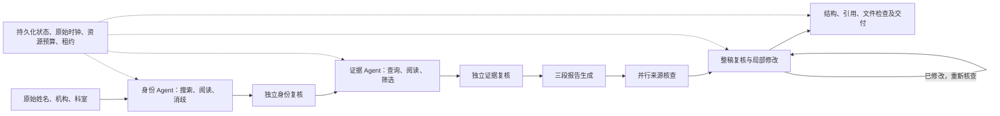

# Doctor Research 设计审视与改进边界

当前结论：使用 Agent 处理身份消歧、资料调查和证据解释的方向合理；先前实现给 Agent 的决策空间、工具反馈与纠错能力不足。仅把模型接在固定检索和字符串校验之后，不能视为已经实现了可靠的研究 Agent。新通路已在隔离环境实现并测试，但完整原始案例验收尚未完成，不能发布为已解决。

本文说明现有设计和剩余风险。具体失败证据、代码版本、回归和额度记录见[实施记录](doctor-research-recovery-memory-2026-09-11.zh-CN.md)，案例进度见[原始输入验收清单](../../artifacts/doctor-research-agent-2026-09-10/known-case-acceptance.json)。

## 各部分应负责什么

| 工作 | Agent 的职责 | 代码的职责 |
| --- | --- | --- |
| 搜索与读取 | 根据结果调整查询、选择链接、判断何时补查 | 执行工具、记录来源和请求状态、缓存、限额、取消 |
| 身份核验 | 理解跨语言姓名/机构/科室，区分同名、兼任和历史任职 | 要求实际来源，保留冲突与限制，防止伪造来源 ID |
| 本人论文归属 | 结合选定作者本人单位、公开目录等判断归属 | 确保单位来自该作者，拒绝借用合作者元数据 |
| 研究范围与证据 | 从已核实职责和论文形成范围，理解设计、结果与不确定性 | 保证记录确实读取、年份/引用闭合、格式和资源约束 |
| 撰写和纠错 | 综合证据，修正具体论断，处理来源矛盾 | 提供稳定编辑目标，原子应用修改，绑定候选版本 |
| 独立复核 | 对照原始来源核查身份、归属和科学表述 | 要求修改后再次复核，拒绝结构或产物检查未通过的结果 |
| 交付 | 提供与证据相符的报告、问答和限制 | 持久化任务、租约隔离、文件渲染、哈希与完整交付 |

“阿尔弗雷德医院／内分泌科”与网页英文表述是否相符应由 Agent 结合来源判断，不能由预置医院译名表或简单子串决定。固定代码也不能根据疾病关键词直接宣布研究设计、从共同作者单位推断本人单位，或把网络超时说成医生不存在。

## 当前改进通路

Agent 是可看到工具结果、连续决策并修改计划的循环。独立调用用于复核；同一模型再次调用并不保证没有共同盲点，不能把“模型批准”当成事实保证。实际试验已出现整稿多次批准仍漏掉有症状/无症状差异，因此增加按来源分工的核查，并允许纠正之前生成的核心证据表。原始摘要始终高于先前模型的解释。

机械引用不必依赖模型逐字抄写长段落。代码可以提供原文片段编号，Agent 选择证据，代码插入确切原文，再由独立模型判断支撑关系。这个分工同时减少格式错误和事实判断的硬编码。局部修改绑定完整提案/候选哈希，不能借纠错越过来源和复核要求。

## 耗时与失败应怎样判断

计时从请求创建开始，到全部可用文件交付为止，包含排队、搜索、阅读、模型、纠错与重试：**≤300 秒优秀，≤480 秒可接受，>480 秒调查原因**。超过 8 分钟不等于必须强制终止；服务另有硬截止时间。失败任务即使很快，也不能归为优秀。复用历史资料的诊断回放只用于定位问题，不能替代完整服务耗时验收。

需要区分成功空结果、请求失败、证据不足、真实身份冲突、输入容量、输出容量、调用额度、硬截止以及文件交付失败。调查超时必须保留真实请求 ID、阶段耗时、排队等待和终止来源，不能让模型猜测基础设施状态。恢复保留原始时钟和已用资源，只重做未完成操作。

节省 SerpAPI：身份后的文献调查不提供付费网页搜索；已读资料在同一任务复用；真实探针逐个设硬上限；允许服务商正常缓存；回放关闭搜索。统计同时保留 HTTP 请求数与免费账户查询，不能将缓存请求一律计作付费次数。

## 仍须解决或验证的部分

- 15 位已知医生仍须在原始三字段、无预置事实/链接的条件下完成真实服务验收；单元测试和身份通过不足以证明这一点。还须覆盖公共 API 准入和真实队列。
- 多轮模型的输出正确性与收敛速度尚不稳定。当前修复先减少整份提案重复生成，并保留来源核查；不能用增加调用次数或放松内容合同代替验收。
- 40 篇目标文献、完整摘要和报告同时进入模型时，输入容量仍需实测。必要时按来源分组核验并保留完整覆盖，不能默默截断关键证据。
- 三段写作目前仍按索引分配文献，尚未改为 Agent 先规划共享提纲与证据分配。它可能造成逐篇罗列和段落重复，是后续连贯性优化点。
- 明确 ORCID 输入、真正同名歧义的补充信息流程，以及 SerpAPI 异步搜索任务 ID 的持久化恢复，仍未完整贯通。
- 旧兼容流程与新 Agent 通路并存，试验开关默认关闭。部署需明确启用条件、完整质量门槛和回退行为，并从已测试的不可变版本发布。

验收材料须区分“代码机制已测”“真实模型已测”“原始案例完整通过”和“生产已部署”。目前仅前两类有部分证据，不能把它们合并为服务已恢复。
