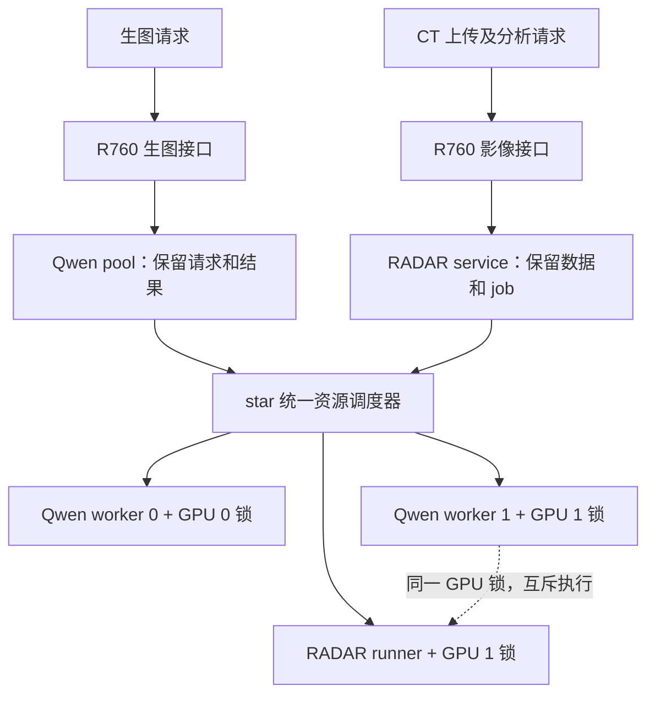
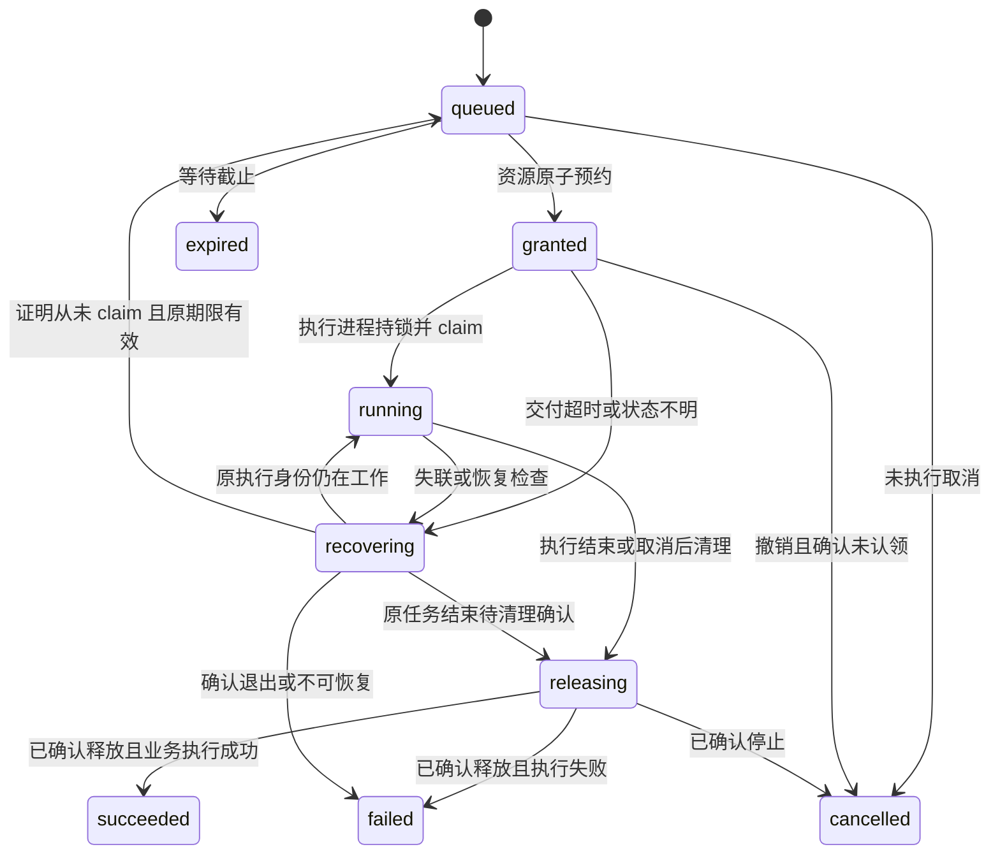

# star 生图与 CT 统一资源调度实施方案

日期：2026-09-22。状态：**已进入实现与 mock 验证；生产状态以发布回执为准。用户已授权 mock 充分验证后切换真实调度。**

实现说明：实际代码、数据库结构、故障语义、部署及回退命令见 [调度器运行说明](../../services/star-gpu-scheduler/README.md)。首版使用 `tasks` JSON 元数据记录、`slots`、`events`、`meta` 四张表；CT 主机内存按完整 32 GiB 保守预约；运行回执按任务保存到用户 runtime 目录，随主机重启清理。本文后续章节中的目标表结构和真实推理验收矩阵属于设计参考；本次按用户最新要求使用隔离 mock 验证上线，不额外提交真实生图或 CT 推理请求。

目标：保持现有生图、CT 两套外部接口，让 Qwen 与 RADAR 在同一个资源调度器中申请执行名额，消除 GPU 1 上两者同时启动的竞争窗口；没有 CT 时保留双卡生图能力，有 CT 时优先安排 GPU 1 读片。调度同时检查主机内存，资源不足时降低并发。

## 1. 本版确定的决策

| 项目 | 实施决策 |
| --- | --- |
| 外部接口 | 生图继续同步返回；CT 继续上传、提交异步 job、轮询、下载。客户端及 R760 认证合同不变。 |
| 部署位置 | star 新增 `star-gpu-scheduler.service`，单实例、本机 Unix socket，不开 TCP 或公网端口。 |
| 职责 | 调度器只保存任务元数据、资源预约和执行状态；提示词、图片、CT 文件、结果仍归原服务。 |
| GPU 0 | Qwen 生图。 |
| GPU 1 | RADAR 优先；无待执行 CT 时可分配 Qwen。正在执行的任务不因新任务到来而被抢占。 |
| 同类顺序 | 调度器收到的、已准备好执行的任务按持久化序号 FIFO；上传先后不等于 GPU 入队先后。 |
| 硬性互斥 | 调度器原子预约 + 实际执行进程持有的 Linux `flock`。仅看显存和进程内锁不够。 |
| 故障行为 | 调度器异常时禁止新 GPU 执行；已执行任务保留锁并受原有超时限制。心跳失联不自动释放 GPU。 |
| 生图后备 | 保留当前云端后备；不恢复 LLaDA，也不因本方案添加新的模型后备。 |
| 实施边界 | 新调度器、Qwen 适配、RADAR 适配及联合验收。第一版不改模型权重、驱动、风扇、功耗或公网接口。 |
| IndexTTS | 保持现有服务；将其占用计入资源检查和混合负载验收。第一版的执行互斥保证只涵盖 Qwen/RADAR。 |

统一调度不要求所有任务成为同一种业务对象，也不要求把影像数据交给生图服务。

## 2. 已核验的起点

### 2.1 线上与源码

2026-09-22 03:38 UTC 对 star 做只读复核：

| 组件 | 当前实现 / 部署 | 关键行为 |
| --- | --- | --- |
| Qwen pool | `qwen-image-pool.service`，`127.0.0.1:8191` | 进程内 FIFO，最多 4 个在途任务，最多 2 个执行；只协调两个 Qwen worker。 |
| Qwen worker 0 / 1 | `127.0.0.1:8200` / `8201` | 每卡一个长驻进程，BF16、CPU offload、40 步、CFG 1；每进程有自己的线程锁。 |
| Qwen 源码 | `/data/apps/qwen-image-21-eval/releases/603efbff159913b286798eddaa09a44b40644db6` | 本仓库 `scripts/experiments/qwen-image-21-eval/`。 |
| RADAR | `radar-imaging.service`，私有 HTTPS `192.168.77.7:8786` | `/data/apps/radar-imaging/releases/20260921-v3`，SQLite 队列；每任务启动受限 systemd 子单元。 |
| RADAR 源码 | `medevidence-opencode-stable/services/radar-imaging/` | 目录最后一次提交 `6829708ed59121257597e9cf19398093be059b1f`；本地两个关键文件与运行版本哈希相同。 |
| IndexTTS | `indextts2.service`，GPU 1 | 长驻约 8,590 MiB GPU 显存；现有锁只约束 TTS 自身，不参与 Qwen/RADAR 调度。 |
| R760 Gateway | 已部署版本记录 `f8c1a943d31769125fb80574b22eab6f6c74b06f` | 本次设计未重新发布 Gateway；实施前重新核验实际版本和配置。 |

RADAR 关键文件 SHA-256：

```text
server.py     2d9a6134c178c4a0a10322136c437e85844c5719d5639ae66a46f4926ea59b39
run_model.py  7b122e902a8c9d87ad0b3bd48c10b384a2be4989bab7e8f07e86fec12368b39e
```

物理设备绑定使用 UUID，不把当前数字索引当作永久身份：

```text
GPU 0  GPU-9df0d9aa-0e98-59af-1de3-0d1ff8564c98
GPU 1  GPU-b78f29ae-cd33-3c2c-9609-b898f1142c50
```

两张卡 `memory.total` 均为 49,140 MiB。实测 `used + free` 不必等于 total，不能用相减代替 `memory.free` 读数。

### 2.2 当前资源门槛和问题

| 项目 | 当前数值 / 行为 |
| --- | --- |
| Qwen 启动准入 | 整卡空闲显存 ≥30,000 MiB，温度 ≤80°C。 |
| Qwen 运行保护 | ≥88°C 或监测失败时在推理回调中中止；每秒采样，不是硬实时保护。 |
| RADAR 启动准入 | GPU 1 空闲显存 ≥32 GiB；队列每 5 秒重查，runner 再查一次。 |
| RADAR 运行保护 | 空闲显存连续两次一秒采样低于 8 GiB，结束该推理子进程。 |
| RADAR 单任务 | CPU 内存上限 32 GiB、8 核配额、禁止额外 swap、运行上限 900 秒。 |
| Qwen 主机内存 | 每个 worker 的 `MemoryMax=56G`；现场 `MemoryCurrent` 分别约 35.7 / 34.6 GiB。 |
| 主机 | 约 125.5 GiB RAM；现场 `MemAvailable` 约 47.5 GiB；约 8 GiB swap 几乎用满。 |

Qwen 生图时 GPU 1 曾测得整卡峰值 25,909 MiB，因此足以令 RADAR 的 32 GiB 启动条件不满足。双方都在任务开始前检查显存，但检查与使用之间没有原子预约；同时启动仍可能通过各自检查。现有 cgroup 上限相加也超过主机容量，不能只解决 GPU 竞争。

RADAR 独立功能补测：2026-09-22 03:32 UTC，完整公开 CT `512×512×368`，新 job `job_c61520e9acde42d78f5a3a11e585f4c4` 成功，私有服务整轮 25.31 秒，15 个资产尺寸 / SHA-256 校验通过；临时 study 已删除。runner 记录 17.664 秒是其墙钟耗时，不是 GPU 活跃时间。原始验收在 `/data/apps/radar-imaging/acceptance/job_c61520e9acde42d78f5a3a11e585f4c4/`。这次测试开始时 Qwen 空闲，不证明混合并发安全。

## 3. 架构与责任边界



这是一个持久化的资源申请队列，包含不同资源需求；不是将请求串行塞进单一执行线程。GPU 1 上等待 CT 不阻塞 GPU 0 的选择，但主机内存不足可能限制两张卡的并发。

| 组件 | 负责 | 不负责 |
| --- | --- | --- |
| R760 | 用户鉴权、套餐和试点权限、外部请求、结果转发、现有云端后备 | star 内 GPU 锁、模型加载 |
| Qwen pool | 图片参数校验、最多 4 个本地在途请求、保存提示词及 HTTP future、结果编码与返回 | 独立决定 GPU 1 可被占用 |
| RADAR service | 上传、校验、序列选择、业务 job、结果和删除、恢复意图 | 独立绕开共享调度启动 runner |
| 调度器 | 全局顺序、资源准入、GPU 预约、执行票据、恢复对账、可观测性 | 图像或 CT 内容、用户余额、临床分析 |
| 模型执行进程 | 核验票据、持有实际锁、推理、清理、报告真实结果 | 修改其他进程状态或抢占其他任务 |

CPU 预处理也是受限任务，但只申请主机内存 / CPU 名额，**不进入 GPU 1 的 CT 优先队列、不持有 GPU 锁**。文件上传和下载不申请调度票据。

## 4. 调度策略

### 4.1 任务类型与容量

| 内部类型 | 生产者 | 允许的执行资源 | 默认容量 |
| --- | --- | --- | --- |
| `image` | Qwen pool | GPU 0 或 GPU 1，对应固定 worker | 全部非终态最多 4 个，运行最多 2 个；包括取消中和释放中。 |
| `ct_infer` | RADAR service | GPU 1，RADAR runner | 运行最多 1 个；所有 CT 内部票据非终态合计最多 32 个，叠加现有业务限额。 |
| `ct_preprocess` | RADAR service | CPU / RAM，无 GPU，profile=`radar_preprocess_v1` | 最多 1 个执行；与 `ct_infer` 共用一个 RADAR 子任务执行名额，保持现有 CPU/RAM 并发边界。 |
| `image_init` | 对应 Qwen worker | 仅本 worker 所属 GPU，profile=`qwen_initialize_v1` | 每 GPU 最多 1 个；独立于 4 个业务 image 限额，启动 / 自动重启时必须使用。 |

队列上限不是公网用户额度；原 Gateway 的每用户 CT 活跃任务 / 每日次数及 star 上传队列限制继续生效。不能利用调度器绕过它们。

### 4.2 每个调度周期

默认周期 250 ms，执行次序固定：

1. 对账释放中 / 异常任务，处理取消、过期、生产者失联，刷新最近一秒资源快照。
2. 若 GPU 1 可分配且存在有效、已准备好的 `ct_infer`，先尝试最早一单 CT。
3. 如果某 worker 尚未加载，先在其卡上安排初始化票据；GPU 1 的初始化仍排在已准备好的 CT 后面。将最早的图片分配给已加载、可用的 GPU 0；如果 GPU 1 无 CT 等待且已加载，再将下一单图片分配给 GPU 1。
4. 无 `ct_infer` 占用 RADAR 执行名额时，可以启动一个 CPU 预处理；不得延迟已经准备好的 CT 来运行新的预处理。
5. 每次预约都在一个短事务里完成：重新核验状态与截止时间、申请主机资源、占用 GPU 槽、增加 generation、写入事件后提交。事务内不做模型调用、网络等待或 `nvidia-smi`。

GPU 1 有 CT 排队但暂因温度、显存或主机内存不足不能执行时，保留 CT 的顺序，不借此插入新的 GPU 1 生图。GPU 0 可以运行图片，但必须在内存规划中保留最早 CT 的内存需求，避免连续图片反复用尽 CT 所需余量。CPU 预处理同样不得消耗这份保留预算。

CT 优先是任务类型优先，不推断患者病情紧急程度。第一版没有客户端可设的 priority，不做任意插队。图片有 GPU 0 和明确等待上限；GPU 0 故障且 CT 持续到来时，图片可能转云端，不承诺 GPU 1 上的图片等待上界。CT 队列也没有固定完成时限承诺：前序 CT、温度、TTS 和主机资源均可能延迟执行。

### 4.3 可执行的调度示意

```text
tick():
    reconcile_and_expire()
    snapshot = fresh_host_gpu_snapshot()
    oldest_ct = oldest_live_queued_ct_infer()
    if gpu1.can_reserve and oldest_ct:
        reserve_if_admissible(oldest_ct, gpu1, snapshot)
    reserve_pending_initializations(snapshot, gpu1_allowed=not oldest_ct,
                                    reserve_ram_for=oldest_ct)
    reserve_oldest_image_if_admissible(gpu0, snapshot, reserve_ram_for=oldest_ct)
    if not oldest_ct:
        reserve_oldest_image_if_admissible(gpu1, snapshot)
    reserve_oldest_preprocess_if_admissible(snapshot, reserve_ram_for=oldest_ct)
```

`reserve_if_admissible` 每次使用最新事务内预约账本扣除已发出的预算；不得让本轮两个候选都按同一份未扣减的内存快照通过。CT 已在本轮获准时，不重复保留它的 RAM。已有 CT 执行时只预约正在执行的 CT，不同时为第二个 CT 再占一份 32 GiB；其完成后，下一轮重新优先规划队首 CT。CPU 预处理不绕开同一个 RADAR 执行名额。

### 4.4 示例

```text
时间       GPU 0                      GPU 1
t0         图片 A                     图片 B
t1         A 继续                     B 继续；CT C 入队
t2         图片 D（资源允许时）       B 完成、清理并释放锁后执行 C
t3         D 继续                     C 完成后执行等待的 CT，或最早图片 E
```

不取消 B 来腾卡；不把 C 转到未经验证的 GPU 0；内存准入不满足时 D 也会等待。示意图不构成时延保证。

## 5. 资源准入与锁

### 5.1 GPU 锁的持有人

每张 GPU 建立一个固定文件：

```text
/run/user/<aiuser uid>/star-gpu-arbiter/gpu-<完整 UUID>.lock
```

路径由部署配置和受信任 UUID 映射生成，不接收请求中的任意路径。目录 0700，文件 0600，拒绝符号链接。目录由用户 tmpfiles 或一次性准备单元建立，**不得随调度器服务重启被删除或重建**；锁文件有使用者时绝不能 unlink，否则新旧进程可能锁到不同 inode。它不是 `/tmp` 文件，避免 `PrivateTmp` 导致各服务看到不同锁。

Qwen worker 在进入任何任务 CUDA 操作前直接取得独占非阻塞锁；RADAR 的 `run_model.py` 在导入 / 初始化 CUDA 模型前取得同一 GPU 1 锁，并持有到子进程退出。锁不能只由 pool、HTTP 处理线程之外的短命客户端或 `systemd-run` 启动器持有。

Linux `flock` 是协作锁，独占锁关联打开的文件描述；所有相关描述符关闭或显式解锁才释放。因此它能跨调度器重启保护仍在运行的执行进程，但不能阻止一个完全不遵守协议的程序使用 GPU。[Linux flock(2)](https://man7.org/linux/man-pages/man2/flock.2.html)

### 5.2 预约、认领、释放顺序

1. 调度器将任务从 `queued` 改为 `granted`，预约对应 GPU / RAM，生成 `grant_token` 和该 GPU 单调递增的 `generation`。无 GPU 的预处理使用任务自身递增的 generation。票据与指定 executor 绑定。
2. pool 或 RADAR 将票据交给固定 executor。执行进程先取得正确 UUID 的 `flock`，再向调度器 `claim`。`claim` 检查票据、generation、期限、取消状态、角色、进程身份，成功后将任务记为 `running`。
3. executor 收到明确的 claim 成功响应后，再次检查 GPU / RAM / 温度，然后才能启动 CUDA 工作。响应丢失时通过同一票据查询确认；无法确认就不开始，报告未执行，不新建任务。
4. 执行期间保留锁及任务身份；每 2 秒报告心跳。池的 HTTP 客户端断开不释放执行锁。
5. Qwen 完成后 `cuda.synchronize()`，确保 offload hooks 清理模型驻留并释放可回收缓存；保留受信任的 idle 状态及本单完成记录。不能把图片编码成功等同于 GPU 已释放。清理失败则 worker 不再接单并进入隔离状态。
6. Qwen 持锁发送 `finish`，调度器先记 `releasing`；随后关闭锁 FD 并发送 `released`。调度器探测锁可取得、核对 worker 本单已经结束及资源快照后，才把槽重新设为空闲。
7. RADAR 的 runner 报告结果但持锁直到退出；RADAR supervisor 等待实际 systemd 子单元终止，再发 `released`。调度器核对进程身份消失、锁可取得及显存条件后释放槽。

无 GPU 的 `ct_preprocess` 也有 claim、RAM 预约和进程身份，但不创建 GPU 锁。其执行单元必须终止后才归还 RAM 预约。

**过期 token 永不重新生效；同一次 grant 最多 claim 一个执行身份。** 同进程重复 claim 原样返回原状态。旧 generation 的迟到请求返回 409。生图 worker 的内部生成入口在 enforce 模式缺票据一律拒绝；保留现有 API key 校验，两者同时要求。

### 5.3 显存与温度

第一版保留现有显存门槛及运行保护；调度器增加一层共同准入，不通过降低门槛来提高吞吐：

| Profile | 启动空闲显存 | 调度温度上限 | 运行保护 |
| --- | --- | --- | --- |
| `qwen_bf16_offload_v1` | 30,000 MiB | 80°C | 保留 worker 88°C / 监测失败保护。 |
| `radar_abdominal_v1` | 32,768 MiB | 80°C（新增准入） | 保留 8 GiB 余量保护；runner 增加 ≥88°C / 监测失败的本任务中止，不改驱动。 |
| `qwen_initialize_v1` | 30,000 MiB | 80°C | 持 GPU 锁完成模型初始化和显存清理；180 秒执行上限。 |

快照超过 2 秒、NVML / `nvidia-smi` 失败、未知 GPU 进程或 UUID 不匹配时，新任务等待，原因记录为 `telemetry_unavailable` 或 `unmanaged_gpu_process`，不得放行。

已知长驻进程只有当前受控 Qwen workers 与 IndexTTS，临时进程只接受 `executions` 中登记的 RADAR 身份；匹配 `boot_id + pid + /proc/pid/stat starttime + systemd unit`，不能单凭 PID 数字或进程名放行。Qwen 启动 / 自动重启 / GPU warmup 必须通过 `image_init` 票据；worker 先启动非 CUDA 控制面、显示 loading，注册初始化任务，获准并持锁后才调用原 `load()`，完成并释放后才 ready。调度器允许模型尚未 ready 的指定进程领取初始化票据，不能用“等模型 ready 才授权加载”的循环条件。

初始化等待上限 300 秒、执行上限 180 秒，RAM 按 `56 GiB - 当前 worker 占用` 保守预约。GPU 1 有 ready CT 时不启动新的初始化；CT 的 RAM 保留同样约束 GPU 0 初始化。初始化失败不标记 ready；连续 3 次失败进入隔离，配合 systemd `StartLimitIntervalSec=600/StartLimitBurst=3`，避免无限反复加载。维护 drain 默认也禁止初始化，由 operator 只开放指定 GPU 的初始化阶段，验证后再恢复业务派发。

### 5.4 主机内存

统一记录 MiB，`GiB = 1024 MiB`。初始保守配置：`host_reserve_mib=12288`，RADAR 子任务总并发 1，维持现有 32 GiB 上限。swap 剩余不计入可分配 RAM。

对新候选计算：

```text
headroom_after_reservations = MemAvailable
    - sum(active_or_granted_task_remaining_growth_mib)
    - candidate_growth_mib
    - protected_oldest_ct_growth_mib_if_not_already_reserved

admit only if headroom_after_reservations >= 12288
```

初始 growth 保守按执行 cgroup 上限减当前实际占用计算：Qwen 为 `max(0, 56 GiB - worker MemoryCurrent)`；新 RADAR 子单元为 32 GiB，已启动则扣除其实际占用；预处理同样按 32 GiB。对同一 cgroup 只计算一次，grant 已发出尚未启动时也必须扣预算。长驻 Qwen 的已有内存已反映在 `MemAvailable` 中，不能再全量扣一次。

这会在当前约 47.5 GiB 可用内存下保守限制一些双卡组合，尤其 CT + Qwen；**不能一边保留两个 56 GiB 上限，一边声称所有组合都能安全并行。** 后续只有在最大支持尺寸、完整 CT、TTS 混合负载测出峰值后，才能按新版本 profile 下调资源上限或增长预算；若无法同时满足，采用排队，不关闭保护。

`ct_preprocess` 需要 RAM 票据：否则两个 Qwen 生图期间启动 32 GiB 预处理仍可能耗尽主机内存。上传继续受现有大小 / 并发 / 磁盘限制，不复制整个 CT 到调度器。记录 `MemAvailable`、cgroup `memory.events`、swap in/out；主机余量跌破 8 GiB 时停止新准入并告警，不随意杀死其他服务。

### 5.5 IndexTTS 的边界

IndexTTS 当前没有对外报告可靠的执行中状态，接口自身只有一把 `inference_lock`，不能用 GPU 利用率为零推断它不会立刻开始。第一版只能预算其实际占用、保留余量、监测和做代表性 TTS 混合验收，不能声称 GPU 1 上所有程序完全互斥。

上线门槛包含 TTS + Qwen、TTS + RADAR 负载测试。如果不能保住显存 / 主机余量及语音可用性，GPU 1 的 Qwen 共享模式不启用，保留 GPU 0 生图与既有 CT 服务；报告这一降级。若需要三者严格互斥，第二阶段给 TTS 接入同一票据和锁，并单独设计语音等待上限；本设计不暗中修改或停用 TTS。

## 6. 本机调度接口 v1

### 6.1 传输和权限

- Unix socket：`/run/user/<uid>/star-gpu-arbiter/scheduler.sock`，目录 0700、socket 0600。HTTP/1.1 JSON，仅本机访问。
- Python 3.10 标准库实现 Unix socket HTTP 服务 / 客户端，避免对 RADAR/Qwen 的 Torch 依赖栈增加耦合；单调度主循环 + 单数据库写入队列，HTTP handler 只提交短命操作。
- 独立随机凭据文件分别标识 `qwen_pool`、`qwen_worker_0`、`qwen_worker_1`、`radar_service`、`radar_runner`、`operator`。不复用 Gateway 用户 key 或 RADAR 的外部 service token。
- Unix peer credentials 核验 UID 及 claim 调用进程身份；单元 / 进程启动时间再核对。角色校验阻止误调用。所有服务当前同属 aiuser，这不是对恶意同 UID 程序的强安全隔离。
- 请求 / 响应最多 16 KiB，普通 RPC 2 秒超时，非长轮询。敏感 token 不进访问日志或数据库；`grant_token` 原文只在受保护的进程、响应及第 8.2 节 RADAR 临时票据文件中存在，数据库保存哈希。重启后原客户端持有的 token 仍可核验，无法恢复原文时撤销尚未 claim 的 grant。
- 请求优先级、GPU UUID、最大运行时间、可执行命令均由服务端 profile 决定。拒绝客户端提供的任意命令、文件路径、URL、priority 或绕过限额字段。

### 6.2 端点

| 端点 | 调用者 | 语义 |
| --- | --- | --- |
| `POST /v1/tasks` | pool / RADAR service；worker 仅限初始化 | 幂等注册元数据票据。新建 201；相同 key 同内容 200；不同内容 409。 |
| `GET /v1/tasks/{id}` | 所属生产者 / 指定 executor | 获取状态、等待原因、grant；无权访问 404。 |
| `POST /v1/tasks/{id}/producer-heartbeat` | 原生产者实例 | 表示调用方仍需任务；不等同于 executor 存活。 |
| `POST /v1/tasks/{id}/claim` | 指定 executor | 持锁后原子认领；含 generation、token、执行身份。 |
| `POST /v1/tasks/{id}/heartbeat` | 已认领 executor | 心跳与本单 phase，不允许换 PID、GPU 或 task。 |
| `POST /v1/tasks/{id}/finish` | executor | 记录执行 outcome / 标准错误码，转 `releasing`；不立即归还 GPU。 |
| `POST /v1/tasks/{id}/released` | Qwen executor / RADAR supervisor | 请求对账；确认已安全释放后才终态。 |
| `POST /v1/tasks/{id}/cancel` | 原生产者 | 未执行任务撤销；已执行任务设置取消意图，不提前解锁。 |
| `GET /v1/status` | operator | 脱敏队列、设备、阻塞原因、版本、指标。 |
| `POST /v1/admin/drain` | operator | 全局或 GPU 级禁止新 grant；不取消当前任务。 |
| `POST /v1/admin/resume` | operator | 恢复前必须通过对账、版本和资源检查。 |

注册示例（示意 ID，非真实凭据）：

```json
{
  "schema_version": 1,
  "producer_instance": "pool-<boot-id>-<random>",
  "operation_id": "image-<uuid>",
  "kind": "image",
  "profile": "qwen_bf16_offload_v1",
  "payload_sha256": "<64-lowercase-hex>",
  "queue_timeout_ms": 80000,
  "request_budget_ms": 170000,
  "request_ref": "req-<uuid>"
}
```

生产者身份从凭据获得，不信任 body 自报角色。`request_ref` 可省略，只允许经过校验的请求 ID；不得填提示词、用户姓名或任意会话文本。image 的参数 body 留在 pool 内存，保持既有同步请求语义。`payload_sha256` 绑定规范化后的完整执行参数，包括已确定的 seed；executor 按同一规范复算，防止同票据被误用于另一张图。只保存哈希，不保存原文。

CT 使用原 `job_id` 作为 `operation_id`，kind 为 `ct_infer`，profile 为 `radar_abdominal_v1`，传原 study 的 `expires_at`（Unix 秒）；不传图片请求预算。payload 哈希绑定 job/study revision、series、输入哈希、模型 profile。预处理使用 `study_id:preprocess:v1`，kind 为 `ct_preprocess`，profile 为 `radar_preprocess_v1`，哈希绑定 study revision、输入 SHA-256 和格式。不同 kind 的字段必须逐项白名单校验。

初始化使用 `worker invocation_id:initialize:v1` 作为 operation_id，角色只能申请自身 GPU 的 `image_init`；payload 哈希绑定 worker release、模型版本及固定 profile。权限表须明确只有 Qwen worker 可以注册这一类任务，不能注册其他业务任务。

服务器生成 task ID、接收时间和 FIFO 序号。`(producer_role, operation_id)` 唯一；请求的规范化字段哈希作为 fingerprint，同 key 重试不能刷新等待截止时间。pool 第一次注册前计算剩余预算并固定该 envelope；网络重试原样发送，不能每次缩短字段导致指纹变化或延长截止时间。规范化使用 UTF-8、按 key 排序、无额外空格的 JSON；不进行 Unicode 文本改写。

`producer_instance` 不纳入业务 fingerprint，但不允许任意实例接管。CT 原角色再次 register 时，只有旧生产者已确认退出、票据尚未 claim，才可用同 operation_id 绑定新实例并保留原 sequence / deadline；原 grant 必须先撤销并完成锁检查。已 claim 的 CT 按第 9 节中断恢复。image 不跨 pool 实例接管，因为原 body / HTTP future 不可恢复。

grant 示例：

```json
{
  "task_id": "sched_<uuid>",
  "state": "granted",
  "wait_reason": null,
  "grant": {
    "executor": "qwen_worker_1",
    "gpu_uuid": "GPU-b78f29ae-cd33-3c2c-9609-b898f1142c50",
    "generation": 42,
    "token": "<opaque-secret-not-logged>",
    "claim_within_ms": 15000
  }
}
```

granted 15 秒未 claim 进入恢复检查，**不是到点就把槽给下一单**。如果锁空闲且该 grant 从未 claim，可以撤回并以原序号返回 queued；不刷新原 deadline。最多 2 次未执行的 grant 交付尝试；超限终止本调度票据。已经 claim 的任务不自动重发执行，即使尚未观察到 CUDA 开始。

claim 记录 peer 的 `boot_id / pid / process_start_ticks / unit / invocation_id`，以及 generation。调度器自己核验，不接受仅凭 body 声明的 PID；RADAR supervisor 的 `released` 可以与 runner 身份不同，但必须是该任务登记的父服务。

除 register 外的控制请求固定字段如下；拒绝额外字段，重复请求必须得到相同有效结果：

| 操作 | 请求字段 | 成功响应 / 校验 |
| --- | --- | --- |
| producer-heartbeat | `producer_instance` | 200，更新生产者时戳，不改变 FIFO / deadline。 |
| claim | `generation, grant_token, payload_sha256, unit, invocation_id` | 200，返回该 task 的 `running`、执行期限及 execution identity；PID 从 socket peer 获取并校验。 |
| heartbeat | `generation, grant_token, phase` | 200；phase 仅 `initializing/inference/cleanup`。 |
| finish | `generation, grant_token, outcome, error_code` | 200，返回 `releasing`；outcome 仅 `succeeded/failed/cancelled`，error_code 为服务端白名单。 |
| released | `generation, grant_token` | 未确认释放为 202 / releasing，已终态为 200；不接受客户端自报“空闲”作为唯一依据。 |
| cancel | `producer_instance, reason` | 200 或 202；reason 仅 `client_disconnected/deadline/explicit_cancel/resource_deleted/producer_shutdown`。 |
| drain / resume | `scope, gpu_uuid, reason_code` | scope 仅 `all/gpu`；reason_code 白名单，缺省不提供自由文本。 |

统一响应包含 `schema_version/task_id/state/wait_reason/generation`；按角色决定是否附 grant。错误为 `{"error":{"code":"...","retryable":false}}`，使用 400 `invalid_request`、401 `unauthorized`、404 `not_found`、409 `idempotency_conflict/stale_grant/invalid_transition`、429 `queue_full`、503 `scheduler_unavailable/storage_unavailable`。可重试只说明可重试同一控制操作，不授权重做推理。状态列表接口分页，最多 32 条，保证响应不超过 16 KiB。

### 6.3 公网行为映射

| 内部情况 | 生图接口 | CT 接口 |
| --- | --- | --- |
| 普通排队 | 同步 HTTP 继续等待 | job 保持 `state=queued, stage=waiting_gpu`。CPU 预处理维持 study validating。 |
| image 本地容量满 | Qwen 层 429 + `Retry-After: 30`；Gateway 保留现有后备处理 | 不适用。 |
| CT 内部票据容量满 | 不影响已接收图片 | 已被接收的 CT job 留在业务队列等待，不能丢失；新的业务提交仍受现有 429 限额。 |
| 调度器不可用 | 未执行图片返回可重试 503，允许现有云端后备 | 已接受 job 保持 queued；控制 / 上传接口可用。能力接口表示服务已配置，不承诺 GPU 立即可用。 |
| 图片排队 ≥80 秒 | 撤销未执行票据，Qwen 层 503；后备链不含 LLaDA | 不适用。 |
| CT 到达原 expires_at | 不适用 | 原业务过期 / 清理流程生效，不延长 24 小时保留期限。 |
| 运行失败 / 资源保护 | 记录失败，清理后释放；按既有 Gateway 错误分类决定后备 | job failed，保留标准错误码；原 job 不自动重新推理，用户明确重试创建新 job。 |
| HTTP 断开 | 排队中取消；执行中标记结果不再需要，继续持锁直到结束 | 控制连接断开不取消已接受 CT job。 |

第一版不增加 CT 公网枚举。现有 Gateway 只接受 `queued/preprocessing/running/postprocessing/completed/failed/cancel_requested/cancelled/expired` 等已定义状态，以及 `waiting_gpu/interrupted` stage；新的 `scheduler_unavailable`、`waiting_memory`、`waiting_temperature` 只作为内部 wait_reason，外部排队统一映射为 `queued / waiting_gpu`，避免协议校验变成 503。GPU 用时字段继续为空，调度占用时长不是 GPU 活跃用时。

生图现有预算保持：pool 总计 170 秒，Qwen 上游 180 秒，Gateway 全链路 240 秒。80 秒等待属于 170 秒内，执行只能使用剩余预算；不能排队后再给一整份 170 秒。现有客户端 210 秒与 Gateway 240 秒的差异单独记录，不能借本方案宣称已修复。

## 7. 状态机与持久化

### 7.1 调度任务状态



GPU 状态独立为 `idle / reserved / busy / releasing / quarantined / draining`；任务失败和设备重新可用是两件事。不能为方便对外返回失败而先清空设备占用。

生图 pool 重启后没有原请求 body：取消它遗留的未执行票据；执行中的 worker 继续持锁，完成后丢弃无人接收的图片。不从数据库凭 task ID 再次生成。CT 的业务对象可持久恢复，但已经 claim 后发生执行中断仍明确失败，不自动重放。

### 7.2 数据库

使用独立本地 SQLite：`/data/apps/star-gpu-scheduler/state/scheduler.sqlite`，目录 0700，DB/WAL/SHM 0600。不得放进 Gateway 数据库或 RADAR `execution.sqlite`。只有调度器访问此库。

采用 WAL、`synchronous=FULL`、`foreign_keys=ON`、`busy_timeout=1000`。预约 / 状态转换使用短 `BEGIN IMMEDIATE` 事务，处理 `SQLITE_BUSY`，禁止一边持有写事务一边等推理。SQLite 同时只有一个写事务；这些配置服务于低频元数据持久化，不承担模型并发。[SQLite transaction 文档](https://sqlite.org/lang_transaction.html)

最低表结构：

| 表 | 必须字段 / 约束 |
| --- | --- |
| `schema_meta` | schema_version、deployment_revision、protocol_version。 |
| `tasks` | 自增 `sequence`；task_id UNIQUE；producer_role、producer_instance、operation_id、fingerprint、payload_sha256；kind、profile；state、wait_reason；created_at、queue_deadline、request_deadline、expires_at；assigned_gpu、generation；grant_token_hash、grant_attempts；outcome、error_code；cancel_requested；UNIQUE(producer_role,operation_id)。 |
| `gpu_slots` | gpu_uuid PRIMARY KEY；generation；state；active_task_id UNIQUE NULLABLE；observed_at；drain_reason。 |
| `executions` | task_id UNIQUE；executor_role、boot_id、pid、start_ticks、unit、invocation_id；claimed_at、last_heartbeat_at、finished_at、released_at；cleanup_verified。 |
| `producers` | role + instance_id UNIQUE；boot_id、pid、start_ticks、unit；last_heartbeat_at、state；用于失联处理和受控重新绑定。 |
| `ram_reservations` | task_id PRIMARY KEY；cgroup_identity、max_bytes、last_current_bytes、reserved_growth_bytes。 |
| `events` | 单调 event_id；task_id、时间、from_state、to_state、reason、gpu_uuid、generation、执行身份引用；不含 payload/token。 |

SQL CHECK 约束 task kind/state/profile；GPU slot 与任务状态在同一事务变更；恢复时校验双向一致性。RAM 预算也在此事务内预约。只有 `queued` 且未过期、未取消的任务可取得新 slot。

时间记录 UTC Unix 毫秒；进程内计时使用 monotonic。重启按持久 deadline 计算剩余时间并限定不超过原预算；检测系统时间异常跳变时先冻结新 grant、对账并告警，不因时钟回拨延长图片等待。sequence 决定公平顺序，不按可回拨的时间排序。

终态元数据和 events 保留 30 天，按小批量清理；活跃、recovering、quarantined 关联记录不能清理。不保存 CT 内容、文件名、prompt 或完整用户标识。新 schema 必须配迁移 / 回退可读性说明，不能恢复旧 DB 快照来复活已执行任务。

## 8. 对现有组件的具体改动

### 8.1 Qwen pool / worker

`scripts/experiments/qwen-image-21-eval/qwen_pool.py`：

- 保留参数校验、最多 4 个在途 admission 和 HTTP future。删除独立挑选 GPU 的权威逻辑，改为向调度器注册 image、查询 grant、派发到 grant 指定 worker。
- 任务从 pool 接收时就开始计时；进入调度器前耗时计入 80 / 170 秒，不形成两段排队预算。adapter 只能向下收紧剩余预算。
- private worker 请求加入受信任调度票据；不把它当公网 schema 字段，也不透传客户端同名 header。
- 生产者每 2 秒心跳。queued 取消调用调度器 cancel；已派发超时记录 abandoned 并对账，不在另一个 Qwen 副本重新执行。
- `/healthz` 区分模型 ready、调度器 ready、可立即接单。模型已加载但卡被 CT 占用应显示等待，不误报模型损坏。
- 内部 dispatch 回执增加 task_id、assigned GPU、queue_ms、execution_wall_ms；公网尺寸、格式、模型名和结果字段不变。

`qwen_eval_api.py`：

- 保留本进程 lock，再增加共享 GPU 锁、claim、心跳、finish/released；所有早退 / 异常路径覆盖。
- 认证的内部状态端点提供当前 task_id / generation / phase，以及最近一次已释放任务的 receipt；恢复不得只依据旧 `/healthz busy=false`。
- 内部生成路径缺票据时拒绝。evaluation / benchmark 脚本改为经过 pool，不保留可绕开共享锁的直连后门。
- 启动流程改为第 5.3 节 `image_init`；自动重启不能先加载 CUDA 模型、后补申请票据。初始化阶段也保留心跳和进程身份。
- 清理不可确认则进入 unavailable / quarantined。需要终止卡死 worker 时只操作其 systemd 单元，并先核对 execution identity。

### 8.2 RADAR service / runner

`medevidence-opencode-stable/services/radar-imaging/server.py`：

- 沿用业务 `execution.sqlite`，新增独立 `scheduler_links` 表记录 `(resource_id, phase) → task_id/operation_id`，保持 public payload 不变。register 先后崩溃通过稳定 operation_id 重试补链，禁止双任务。
- 将 `work()` 从“找到首个 queued 就睡等显存”改为控制循环：清理 / 取消始终处理；已 ready 的 CT 向共享队列注册；等待 grant 时不阻塞上传、控制请求和过期清理。
- 预处理先申请 host-only 票据；最多一个 RADAR 子单元运行。已有待推理 CT 优先于启动新的预处理，避免 CPU 任务占着唯一 runner 名额拖延 CT。
- 只有获得 grant 后才启动受限 `radar-task-<id>`；去掉把独立显存轮询作为启动权限来源的逻辑，但保留 runner 二次资源检查。
- queued job 取消 / 删除时先持久化原业务意图，再撤销调度票据。running 时停止该 job 的具体单元，确认退出后归还资源。
- `recover()` 必须先对账 scheduler_links 与 systemd，不能重启后直接给仍在运行的旧进程发第二份票据。

`run_model.py`：

- 使用固定 profile 对应 GPU UUID；持锁和 claim 成功后才能初始化 CUDA。
- 从受保护 job 目录读取 0600 的票据文件，路径通过现有受限参数传入；token 不放命令行或日志。结束后删除本次临时票据文件。
- 保留模型哈希、结果范围检查、32 GiB / 900 秒 / 显存保护；增加心跳和温度监测。监控异常只停止本任务。
- runner 持锁直到退出；首次实现允许将锁保留到输出文件生成完毕，优先保证正确性。以后若拆分 GPU 与 CPU 后处理，需要另行验证释放顺序和状态转换。

RADAR `python -I` 不读取任意 `PYTHONPATH`；共享客户端须以版本固定的纯 Python wheel 安装进其现有 venv，不能依赖临时工作目录导入成功。

`process_input.py` 同步增加 host-only claim / heartbeat / finish 生命周期，仍在既有 32 GiB 受限子单元执行；父服务确认该进程退出后 released。不能只给 `run_model.py` 接入客户端而漏掉预处理内存预约。

### 8.3 Gateway / 客户端

第一阶段不要求修改生产 Gateway / Desktop。实现时用现有严格 contract 测试验证 CT 状态和错误映射，生图延续 429/503 的现有后备处理，不加入 LLaDA。

新的等待原因先放内部观测；若未来需要客户端显示“等待 GPU”“排队位置”，另行扩展合同。CT 优先与两张卡会改变相对顺序，不能把一个全局整数队位当作准确预计完成时间。

## 9. 故障与恢复规则

| 情景 | 处理与允许的后续行为 |
| --- | --- |
| 调度器崩溃，executor 仍运行 | executor 的 flock 继续保护 GPU。重启后先读 DB、检查锁及 execution identity，原任务对账为 running；此 GPU 不接新任务。 |
| executor 心跳超过 10 秒未更新 | 进入 recovering，停止该 GPU 新准入，查询实际进程 / 单元 / 锁；不能按心跳 TTL 自动释放。 |
| worker/runner 异常退出 | 确认特定启动身份已消失、锁已释放、GPU 资源快照正常后，将原任务 failed 并重新开放 GPU；不重放推理。 |
| granted 尚未 claim 就取消 | 原子撤销 grant，使迟到 claim 返回 409；锁空闲且未执行后终止票据。 |
| cancel 与 claim 同时到来 | 由同一事务串行化：cancel 先则 claim 拒绝；claim 先则按已执行任务取消处理，不能提前解锁。 |
| finish/释放响应丢失 | 同 task/generation 重试幂等；锁空闲 + executor receipt / 子单元退出对账后收敛。不同 outcome 的重复 finish 返回 409。 |
| pool 退出 | 未执行 image 由生产者失联 10 秒规则取消；运行中保持锁，完成后不再向已断开的客户端交付。 |
| RADAR 生产者失联但是否退出不明 | 未 claim CT 暂停发 grant；已发未 claim grant 撤销并对账。业务 job 保持 queued；原服务恢复心跳或确认旧服务退出后按 register 规则重新绑定，不能丢掉 CT。 |
| RADAR service 重启 | queued CT 可按 operation_id 重新绑定生产者；已 claim 的 CT 按现有中断规则停止原子单元并明确失败，再对账释放。 |
| 整机重启 | boot_id 改变；旧运行任务明确中断失败。旧 image 排队取消；CT queued 在原期限内可恢复。启动预热完成、所有执行器证明受控后再准入。 |
| PID 被复用 | boot_id + start_ticks / invocation_id 不匹配，视为不同执行身份；不能对新进程发 kill，也不能伪认旧任务已完成。 |
| 锁被未知进程持有、文件 inode 改变、清理结果不明 | quarantined；保留记录，阻止新任务，人工核查。不得删除锁文件“解锁”。 |
| 调度库满盘 / 损坏 / 写失败 | 禁止新 grant；已运行任务继续持锁至安全终止。修复前不从空库启动，也不绕过调度恢复双卡。 |
| CUDA OOM / 显存保护 / 温度保护 | 当前任务失败并清理；确认恢复前隔离该 worker。CT 不自动重试。记录具体来源，不能统一写成模型不可用。 |
| 生图 170 秒预算到期仍在推理 | pool 可以返回失败供 Gateway 处理，但原 worker 继续占锁；发送本任务停止请求，回调协作中止。180 秒执行 watchdog 后仍未退出则仅终止该 worker，确认退出后恢复。 |

Qwen watchdog 是 executor 生命周期保护，不能依赖已断开的 HTTP 请求仍活着。CT 维持 systemd 900 秒运行上限。停止后需要确认 CUDA 上下文清理，不能把 `systemctl stop` 命令返回当成全部资源已回收。

调度器启动必须独占一个固定进程锁，防止双实例。数据库事务和执行器 flock 是两层互补措施，不能用其中一层省略另一层。调度器恢复期间全局 `ready=false`；完成逐 GPU 对账后可按卡恢复，单卡异常不必拖垮另一张健康卡。

## 10. 配置与部署形态

### 10.1 新目录 / 单元

```text
/data/apps/star-gpu-scheduler/
  releases/<committed revision>/
  current -> releases/<revision>
  config/policy.json
  config/<role>.token
  state/scheduler.sqlite
  acceptance/<run-id>/

~/.config/systemd/user/star-gpu-scheduler.service
/run/user/<uid>/star-gpu-arbiter/{scheduler.sock,daemon.lock,gpu-<uuid>.lock}
```

新服务初始约束：`MemoryMax=512M`、`CPUQuota=100%`、`Restart=on-failure`、`RestartSec=2`、`TimeoutStopSec=15`、`UMask=0077`；使用独立 Python 3.10 标准库运行目录。正常停止先 drain，新任务不再 grant；停止调度器本身不杀 executor。DB 状态保留供重启对账。

Qwen / RADAR 增加 `After/Wants=star-gpu-scheduler.service`，不使用会因 scheduler 重启而连带终止推理的 `BindsTo/PartOf`。scheduler 的启动只依赖本机文件准备，不反向 `After` 执行器造成启动环。用 `ReadWritePaths` 明确允许 runtime 锁目录，验证现有 `ProtectSystem/ProtectHome/PrivateTmp` 组合下所有服务访问同一 inode。

### 10.2 默认 policy

| 配置 | 初值 |
| --- | --- |
| `protocol_version` / `schema_version` | 1 / 1 |
| `mode` | 预部署 observe，切换后 enforce；切换期间 drain。 |
| `scheduler_tick_ms` / `telemetry_poll_ms` | 250 / 1000 |
| `telemetry_stale_ms` | 2000 |
| `producer_heartbeat_ms` / `producer_stale_ms` | 2000 / 10000 |
| `executor_heartbeat_ms` / `executor_stale_ms` | 2000 / 10000 |
| `grant_claim_timeout_ms` | 15000 |
| `image_max_nonterminal` / `image_queue_wait_ms` | 4 / 80000 |
| `image_total_budget_ms` / `image_execution_watchdog_ms` | 170000 / 180000 |
| `image_init_queue_wait_ms` / `image_init_execution_timeout_ms` | 300000 / 180000 |
| `ct_max_nonterminal_tickets` / `radar_max_active_child` | 32 / 1 |
| `radar_execution_timeout_ms` | 900000 |
| `host_reserve_mib` / `host_stop_admission_mib` | 12288 / 8192 |
| `audit_retention_days` | 30 |
| `gpu1_policy` | `ct_first_nonpreemptive` |

observe 只验证输入、记录建议和指标，**没有互斥保证**；在 enforce 之前不得宣布问题已解决。生产适配器一旦配置 require-scheduler，就没有自动直跑回退开关。policy 只允许 operator 在 drain、校验后原子更新并记录版本。

## 11. 实施拆分与交付物

| 工作包 | 文件 / 所属仓库 | 完成条件 |
| --- | --- | --- |
| A：调度核心 | 本仓库新增 `services/star-gpu-scheduler/`，包含 policy、store、scheduler、IPC server、标准库 client、Linux 锁实现及测试 | 元数据合同、原子预约、RAM 准入、状态机、故障对账通过。 |
| B：客户端包 | 同目录构建 `star_gpu_scheduler_client` 纯 Python wheel，协议版本固定 | 在 Qwen 与 RADAR 两个现有 Python 环境离线 `--no-deps` 安装 / 导入通过，依赖清单无额外升级。 |
| C：Qwen 接入 | 本仓库 `qwen_pool.py`、`qwen_eval_api.py`、两个 systemd 模板、现有测试 / 验收脚本 | 无票据执行拒绝；取消 / 断开不早释放；双卡仍可被调度。 |
| D：RADAR 接入 | 客户端仓库 `services/radar-imaging/server.py`、`run_model.py`、`process_input.py`、测试、部署脚本 / README | 预处理 RAM 票据、CT GPU 票据、取消 / 删除 / 重启恢复、原 API 全部通过。 |
| E：部署与验收 | 本仓库新增受控部署 / 联合验收脚本，操作记录 / 客户端回执 | immutable artifact、备份、drain 切换、回退与真实混合负载证据完整。 |

依赖顺序 A → B → C/D → E。C/D 可以独立编码但共用冻结的 v1 合同；本会话未启动并行代理或其他 worktree。实施时继续使用各仓库既有开发工作区，不复制开发仓库到 star。每个 release manifest 必须包含 scheduler commit、Qwen commit、RADAR commit、client wheel SHA-256、policy SHA-256、协议 / schema 版本及模型版本；不含凭据。

本仓库当前 main 为 `9b47dd0`，仅查得缓存 `origin/main` 与 main 一致，未为本文执行 fetch / 发布。真正准备部署时必须 fetch 并重新核对 main、远端、线上版本，保留当前已有的不相关修改；不得部署脏开发树。另一个仓库必须单独遵守其工作区规则并保留现有改动。

## 12. 上线步骤与安全回退

### 12.1 分阶段上线

1. **离线构建**：完成代码、Linux 测试和协议合同测试；提交所需 revision，制作只含已提交内容的不可变发布包；验证目标环境版本，不改 NVIDIA / Torch 主版本。
2. **只读预检**：核验 star、GPU UUID、各单元 / PID、主机内存与 swap、磁盘、RADAR 当前任务、Qwen active / queued、TTS 基线；与发布清单比较，出现未纳入的线上修复就停止准备并合并。
3. **受控备份**：保存三个服务族的原 current、单元、受保护配置和哈希；对 RADAR / 新调度 DB 用 SQLite backup API 生成一致快照，验证可读；凭据不打印、不进入仓库。
4. **安装未启用组件**：装 scheduler、wheel 和新 releases；observe 运行检查权限、身份识别、资源读数。离线 smoke 不能修改当前服务版本。
5. **停止新增 GPU 工作并排空**：Qwen pool 停止接本地新单，Gateway 按现有策略使用云端；RADAR 继续接受上传 / 控制操作，但暂停新子任务启动。等待现有 Qwen、RADAR 执行结束；不能杀一半 CT 来缩短切换。
6. **一次维护窗口内接齐执行器**：验证共享目录 / 锁 inode；激活 require-scheduler 的 Qwen、RADAR 和 scheduler enforce；模型加载在 drain 下按顺序完成。不存在“旧 RADAR 仍可直跑、新 Qwen 已参与共享”这种混合开放阶段。
7. **关闭旁路验证**：直接调用无票据 worker 应失败；旧评估单元仍 disabled；所有受控执行器协议版本匹配。通过空闲和恢复核查后依次开放 GPU 0、CT、GPU 1 图片共享。
8. **真实验收与观察**：执行第 13 节；记录生效 UTC / 北京时间、实际版本、request/job/task ID、等待与执行区间、GPU / RAM / TTS 读数。至少完成一轮 30 分钟有界混合观察。
9. **交付**：更新运行手册及实际配置；生成给客户端的回执，由用户转发。客户端无需为了调度更换 endpoint / key。

RADAR 首次增加 pause/drain 管理能力应先在同一已审阅版本中实现；若旧版本无该能力，先在确认无在途 CT 后停止其服务并短暂停止 CT 控制入口，明确维护窗口。不能把既有服务没有的接口写进部署脚本后假定它可用。

### 12.2 停止上线的条件

任一发生即保持 drain / 降级并记录：同卡执行区间重叠；任务重复推理；锁路径不一致；取消仍放行；未知执行身份；OOM / 主机 oom_kill；CUDA Xid；TTS 出错或超过验收回归门槛；CT 结果资产不完整；指标无法证明锁生命周期；数据库写入 / 恢复失败。禁止临时放宽内存 / 温度门槛来“通过”。

### 12.3 回退目标

第一回退目标是**GPU 0 Qwen + 原 RADAR GPU 1，Qwen worker 1 停止接单**，避免回到未经协调的两类任务同卡并发。保留原云端后备和 TTS。LLaDA 仍停用。

回退顺序：全局 drain → 等待 / 按明确失败流程停止在途任务并验证释放 → 停用 GPU 1 Qwen → 恢复上一受验 RADAR 与 Qwen pool/worker 0 版本和单卡 backend 配置 → 检查真实 CT / 生图和持久业务状态 → 对外恢复。只恢复代码和必要配置，不恢复旧业务 DB 覆盖新 job；`scheduler_links` 新表向后兼容保留。调度 DB 保留作审计，不重放。

这一单卡回退配置需作为本发布的不可变、已测试 artifact 提前准备，不能回退时临时改代码。旧双 Qwen 发布记录中恢复 LLaDA 的整套 rollback 脚本不适用于本方案。

## 13. 验收矩阵与通过标准

### 13.1 确定性测试（Linux，无真实模型）

| 编号 | 场景 | 必须证明 |
| --- | --- | --- |
| T01 | 同时注册图片 / CT，重复并发 claim | GPU 1 永远只有一个有效 executor；GPU 0 不被无关 CT 队首阻塞。 |
| T02 | 同类 FIFO；CT 插入图片队列 | 已执行图片不中断；下一次 GPU 1 grant 给最早 CT；无 CT 时可派两个 image。 |
| T03 | CT 无足够 RAM，GPU 0 连续图片 | 保留 CT RAM 预算，不被新图反复抢走；不重复扣已预约内存。 |
| T04 | 4 个 image、第五个；32 个 CT ticket | 容量含 granted/running/releasing；拒绝或等待符合合同，无漏计。 |
| T05 | 图片队列 80 秒、总计 170 秒 | 使用原截止时间；重复注册 / 再 grant 不刷新预算。 |
| T06 | 两个真实 Linux 子进程竞争 flock | 同 inode 独占；PrivateTmp / sandbox 下仍共享；broker 退出不释放 executor 的锁。 |
| T07 | stale generation、错误 GPU / PID / role、无 token | 全部拒绝，未执行 CUDA 模拟步骤，token 不进日志。 |
| T08 | cancel 与 claim、finish 与 disconnect 竞态 | 状态转换单一且幂等，未完成清理不得再发同卡 grant。 |
| T09 | broker、pool、RADAR supervisor、executor 在各边界崩溃 | 恢复无重复执行、无过早释放；已 claim 不重放；明确失败可追踪。 |
| T10 | claim / finish 响应丢失，心跳暂停，PID 复用 | 同 operation 对账，心跳 TTL 不充当解锁条件。 |
| T11 | DB busy / 满盘 / 损坏、时钟回拨、旧 boot ID | 停止新准入，保留任务事实；恢复过程不从空状态放行。 |
| T12 | telemetry stale / GPU hot / unmanaged PID | 映射稳定等待原因，不将 CPU 等待或调度失败伪装成模型失败。 |
| T13 | CT 注册前后崩溃、study 删除、到期 | scheduler_links 可幂等补齐，取消无漏单，无过期数据继续推理。 |
| T14 | CT 各内部等待原因经原 Gateway contract | 公网枚举不变；鉴权、跨 owner 404、错误脱敏、取消/删除仍通过。 |
| T15 | 模型初始化、直连 worker、旧评估脚本 | 不能绕过 enforce；重启加载不会与 CT 并发触碰同卡。 |
| T16 | CPU 预处理 + GPU 工作、主机内存预约 | 预处理不锁 GPU，但占 RAM / RADAR 子单元名额；资源账本正确。 |

已有 Qwen 10 项测试、RADAR 服务测试及 Gateway imaging 合同测试须按改动继续执行；新锁 / systemd 行为必须在 Linux 测，不能只在 Windows mock 后宣布通过。

### 13.2 真实模型验收

输入仅使用既有公开 CT 和固定无患者信息的图片提示词。保留实际生成结果及校验，不将健康接口 200 当成推理成功。

| 编号 | 场景 | 通过条件 |
| --- | --- | --- |
| L01 | Qwen 方 / 横 / 竖 × JPEG / PNG / WebP | 9 项全部成功，字节头、尺寸 / 哈希正确，Gateway 实际 provider 为 Qwen。文字准确性另评，不归功于调度改动。 |
| L02 | 完整公开 CT 单独执行 | 新 job completed，146 项有限评分、15 资产核验、下载成功；显存释放。 |
| L03 | 两张生图在途时提交 CT + 后续图片 | CT 不抢占当前图；GPU 1 释放后 CT 先执行；GPU 0 在 RAM 允许时继续图片，受阻时原因可解释。 |
| L04 | CT 在途时连续提交图片 | 无 GPU 1 同时生图；GPU 0 可用则派发，否则有界等待 / 既有云端后备。 |
| L05 | 连续 CT + 图片、单 GPU 故障 | FIFO / CT 优先符合政策；图片无无限 HTTP 等待；无 LLaDA。 |
| L06 | 取消排队 CT、取消运行 CT、图片断开 | queued 不执行；运行任务确实终止 / 完成后才解锁；下单无重复执行。 |
| L07 | 有任务时重启 scheduler / 模拟适配器掉线 | 锁仍有效、执行身份可恢复；无两进程同卡执行。高风险故障用隔离测试进程先验证，再做维护窗口内有界演练。 |
| L08 | TTS + Qwen、TTS + RADAR、两卡混合 | 各业务零执行错误、无 oom_kill / Xid、内存和温度不越运行保护；同时记录 TTS 延迟。 |
| L09 | 安全单卡回退演练 | 原 CT job 不复活 / 重跑；单卡 Qwen + RADAR 可用，LLaDA 保持停用。 |

调度核心硬标准：以 executor 的 `claim → CUDA/清理结束并释放锁` 区间为准，GPU 1 的 Qwen 与 RADAR 重叠次数 **0**；从 `nvidia-smi` 一秒采样没有同时看到两个进程，不能单独证明这个标准。

资源已满足、卡空闲且无更早同类任务时，任务获 grant 延迟目标 ≤2 秒；这是调度控制面的验收值，不是 CT / 图片总时延 SLA。与本轮相同参数的新单任务基线相比，模型执行墙钟中位数回归 ≤10%；样本每类至少 5 次，报告全部样本。双卡吞吐只有 RAM 准入允许时测量并报告，不能强行关闭保护复现先前 1.858×。

TTS 混合验收使用经确认的固定文本长度组合，至少 20 次；与同日相同输入独立基线比较，零失败且 p95 增幅 ≤25% 为初始上线门槛，并披露样本量，不当作长期 SLA。未达标则不开放 GPU 1 图片共享，进入第 5.5 节降级。

CT 排队 / 取消 / 删除的临时测试对象全部清理；保留公开样例验收产物与脱敏日志，真实凭据不归档。观测期内每秒 GPU / 主机采样，保留 grant/claim/release 事件、模型输入哈希与 provider 关联。

## 14. 可观测性与交接

必须可按 `Gateway request_id → image operation_id → scheduler task_id → GPU/executor` 或 `CT job_id → scheduler task_id → transient unit` 关联。现有 Gateway 若尚未向私有 Qwen 透传 request ID，先用 pool operation_id 与既有请求回执关联，不伪造端到端 ID；扩展透传需单独增加 Gateway 合同测试。

记录：各类型 queued / running / recovering 数；最老等待时长；grant/claim/release 时间；等待原因；GPU 温度 / 空闲显存；主机 MemAvailable / cgroup 余量；deadline 拒绝；后备触发；unknown identity；锁异常。日志只写受限 ID、标准错误码和数值，不写提示词、CT 路径、用户资料、票据或密钥。

告警条件：同 GPU 出现两个 running claim（立即隔离）；心跳失联 >10 秒；releasing >10 秒；主机余量 <8 GiB；CT 等待 >120 秒（提示排查，不自动重试或改期限）；调度器不可用 >10 秒；TTS / GPU 驱动异常。日志轮转上限 200 MiB，审计按 30 天批量清理，不允许无限增长。

交接回执至少列出：生效时间、全部部署 revision / 哈希、最终 policy、参与调度的任务类型、IndexTTS 未纳入互斥的边界、9 项生图与真实 CT ID、混合调度时间线、重启 / 取消证据、残余限制、单卡回退入口。未通过的项目明确标为未通过或未执行，不把“设计已完成”写成“生产已验证”。

## 15. 依据与关联文件

- [双卡 Qwen 当前部署与验收](../operations/qwen-image-dual-gpu-release-2026-09-22.zh-CN.md)：当前参数、超时、后备、峰值与回退历史。
- [Gateway Imaging v1](../operations/imaging-v1.md)：现有私有 / 公网接口、鉴权、异步 job、保留期、试点和错误合同。
- [Qwen pool 源码](../../scripts/experiments/qwen-image-21-eval/qwen_pool.py) 与 [worker 源码](../../scripts/experiments/qwen-image-21-eval/qwen_eval_api.py)：当前队列、锁与清理实现。
- [Gateway CT 合同校验](../../apps/gateway/src/imaging/contract.ts)：现有状态白名单，第一版必须兼容。
- RADAR 对应工作区：`C:\work\code\medevidence-opencode-stable\services\radar-imaging\`，README、server.py、run_model.py、test_service.py、deploy.sh；本文第 2 节给出现场比对哈希。
- IndexTTS 现场源码：`/home/aiuser/apps/indextts2-service/service.py`；2026-09-22 只读核验，本轮未修改。
- [Linux flock(2)](https://man7.org/linux/man-pages/man2/flock.2.html) 与 [SQLite transaction](https://sqlite.org/lang_transaction.html)：锁生命周期及事务语义的实现依据；其余策略 / 阈值为本方案的明确设计选择，并非外部标准。

本文完成的交付仅为可实施设计。实现、上线和真实混合负载验收应分别记录结果。
